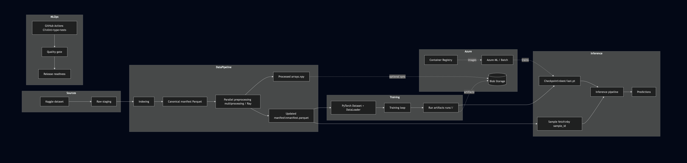

# High-Level Design (HLD)

This HLD focuses on **scalable ML infrastructure** for multimodal biometric recognition
(fingerprint + iris-left + iris-right). It is intentionally model-agnostic.

## HLD Diagram

## Data contracts
- **Manifest** (`manifest.parquet`): stable metadata interface between data and training.
- **Processed arrays** (`.npy`): mmap-friendly for fast training reads.
