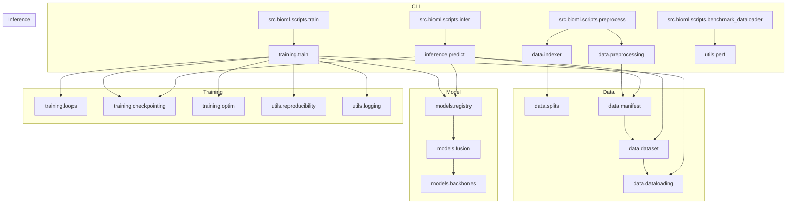
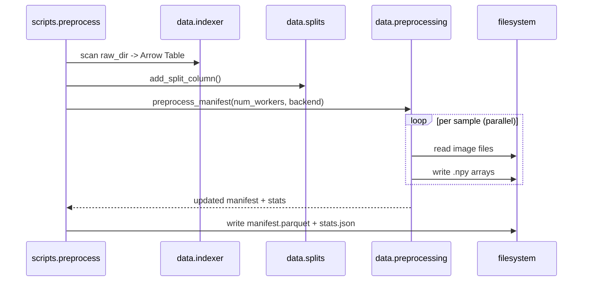

# Low-Level Design (LLD)

## Module diagram

```mermaid
flowchart TB
  subgraph CLI
    P1[src.bioml.scripts.preprocess] --> I1[data.indexer]
    P1 --> PR1[data.preprocessing]
    P2[src.bioml.scripts.train] --> T1[training.train]
    P3[src.bioml.scripts.infer] --> INF1[inference.predict]
    P4[src.bioml.scripts.benchmark_dataloader] --> PERF1[utils.perf]
  end

  subgraph Data
    I1 --> SPL[data.splits]
    PR1 --> MAN[data.manifest]
    MAN --> DS[data.dataset]
    DS --> DL[data.dataloading]
  end

  subgraph Model
    REG[models.registry] --> FUS[models.fusion]
    FUS --> BB[models.backbones]
  end

  subgraph Training
    T1 --> REG
    T1 --> DL
    T1 --> LOOP[training.loops]
    T1 --> CKPT[training.checkpointing]
    T1 --> OPT[training.optim]
    T1 --> REP[utils.reproducibility]
    T1 --> LOG[utils.logging]
  end

  subgraph Inference
    INF1 --> MAN
    INF1 --> DS
    INF1 --> REG
    INF1 --> CKPT
  end
```

## Preprocessing sequence

```mermaid
sequenceDiagram
  participant CLI as scripts.preprocess
  participant IDX as data.indexer
  participant SPL as data.splits
  participant PRE as data.preprocessing
  participant FS as filesystem

  CLI->>IDX: scan raw_dir -> Arrow Table
  CLI->>SPL: add_split_column()
  CLI->>PRE: preprocess_manifest(num_workers, backend)
  loop per sample (parallel)
    PRE->>FS: read image files
    PRE->>FS: write .npy arrays
  end
  PRE-->>CLI: updated manifest + stats
  CLI->>FS: write manifest.parquet + stats.json
```
